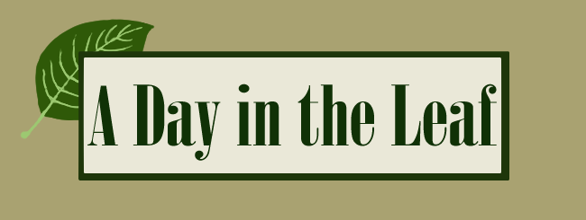

<p align="center">
    <a href="https://github.com/mtownsend509/A-Day-in-the-Leaf/tree/main">Report Bug</a>
    ·
    <a href="https://github.com/mtownsend509/A-Day-in-the-Leaf/tree/main">Request A Change</a>
  </p>
</div>

[](https://opensource.org/licenses/MIT)

## Description

This project uses Node.js and Express.js to create a RESTful api, Handlebars.js as a templating engine, MySQL and the Sequelize ORM for a server-side database, and the Cron utility as an automated task scheduler. These programs and dependencies were implemented to create a plant care app that allows the user to track the watering schedule, light exposure, and other health concerns specified by the user for multiple plants. This data is saved within their profile and available to them upon a later login.

This project allowed four contributors to in turn test the pair programming model, work in branches, and merge each individual coding style into the larger collaboration project. Further, it solidified the working knowledge of node, it's dependencies, Tailwind CSS styling, and introduced the Cron utility program.

<!-- Provide a short description explaining the what, why, and how of your project. Use the following questions as a guide:

- What was your motivation?
- Why did you build this project? (Note: the answer is not "Because it was a homework assignment.")
- What problem does it solve?
- What did you learn? -->

## Table of Contents

<!-- If your README is long, add a table of contents to make it easy for users to find what they need. -->

- [Installation](#installation)
- [Usage](#usage)
- [Credits](#credits)
- [License](#license)
- [Badges](#badges)
- [Features](#features)
- [Questions](#questions)


## Installation

<!-- TODO: update link
TODO: beef up -->
### Visit The Deployed Application
Follow this [link]() to visit the app and create an account by entering a username and password at the main page. Once you're logged in, you can add new plants and the associated information information. Once added, you can track their watering, growth, care, etc.

### How to Install Locally
<!-- What are the steps required to install your project? Provide a step-by-step description of how to get the development environment running. -->
1. From the GitHub repository, copy code from the <> Code button
2. Clone locally using CLI or VSCode terminal
3. Ensure all necessary technology is installed (mySQL, Node.js)
4. Install dependancies using NPM i
5. Be sure to run Schema.sql through mySQL and start the server before testing
6. Run application in your browser locally using "http://localhost:3001/"
5. Play as you'd like!

## Usage

<!-- TODO: add pictures -->

There are 8 main sections of this repository:

- [Controllers Folder](https://github.com/mtownsend509/A-Day-in-the-Leaf/tree/Develope/Controllers) -  Contains JS route functions for homepage, dashboard, signup, login, logout, and plant groups, including GET, POST, PUT, and DELETE routes

- [Config Folder](https://github.com/mtownsend509/A-Day-in-the-Leaf/tree/Develope/Config) - Contains the js file enconding dotenv and sequelize functionality for connecting the database

- [DB Folder](https://github.com/mtownsend509/A-Day-in-the-Leaf/tree/Develope/db) - Contains the schema.sql file used for database creation

- [Models Folder](https://github.com/mtownsend509/A-Day-in-the-Leaf/tree/Develope/Models) - Contains all fields and rules for the user and plant models

- [Seeds Folder](https://github.com/mtownsend509/A-Day-in-the-Leaf/tree/Develope/seeds) - Contains the seeds data to populate the database upon app initialization

- [Public Folder](https://github.com/mtownsend509/A-Day-in-the-Leaf/tree/Develope/public) - Contains the main css styling and js functionality for the application

- [Utils Folder](https://github.com/mtownsend509/A-Day-in-the-Leaf/tree/Develope/Utils) - Contains the user session authorization for login redirection and formatting helper functions

- [Views Folder](https://github.com/mtownsend509/A-Day-in-the-Leaf/tree/Develope/views) - Contains all handlebars functions used to encode the webpage

- [Mock Folder](https://github.com/mtownsend509/A-Day-in-the-Leaf/tree/Develope/mock) - Contains the html files used to generate a mockup of each webpage

- [crontest.js](https://github.com/mtownsend509/A-Day-in-the-Leaf/blob/Develope/crontest.js) - Contains the cron utility js file

- [package-lock.json](https://github.com/mtownsend509/A-Day-in-the-Leaf/blob/Develope/package-lock.json) - Contains all the node dependencies

- [package.json](https://github.com/mtownsend509/A-Day-in-the-Leaf/blob/Develope/package.json) - Contains the npm init data and the dependencies

- [server.js](https://github.com/mtownsend509/A-Day-in-the-Leaf/blob/Develope/server.js) - Contains the js file for dependency requirements, sequelize, and session intitialization

- [gitignore](https://github.com/mtownsend509/A-Day-in-the-Leaf/blob/Develope/.gitignore) - Contains all files to be ignored in the Github repository

- [License](https://github.com/abbeydoyle/ecommerce-backend/blob/main/LICENSE) - Contains the webpage license

- [ReadMe](https://github.com/mtownsend509/A-Day-in-the-Leaf/blob/Develope/LICENSE) - This file containing an executive overview of the project

### To Use The Deployed Application
This application uses common website workflow. You will need to log in or sign up before doing anything else. Once logged in you will see an empty dashboard, that's okay! Press the "add plant" button to add your first plant to your dashboard. In the add plant page you will need to add various information about your houseplant's care needs and any other care information you'd like to add. Once you're done press the submit button at the bottom of the page, and your new plant should be populated on your dashboard. Add more if you'd like, or use this plant to help you keep track of it's needs and care using the water button.

<!-- Provide instructions and examples for use. Include screenshots as needed.

To add a screenshot, create an `assets/images` folder in your repository and upload your screenshot to it. Then, using the relative filepath, add it to your README using the following syntax:

    ```md
    
    ``` -->

## Credits

<!-- TODO: contributions -->

This webpage was built using UW Trilogy Bootcamp class materials as references.

There are four contributors to this project. Each member along with their contributions are listed below.

- Zach Beiser: Handlebars, debugging routes, Public JS, User Story, README, wireframing  

- Katrina Baker: Routes, handlebars, presentation, image sourcing, logo design, debugging

- Abigail Doyle: HTML, Tailwind Styling, Debugging, Handlebars, models, navigation and functionality for handlebars

- Matthew Townsend: DB schema,  Public JS, Seeds, models, Debugging, CronJob, plant graveyard, functionality and navigation

## License

MIT License

Copyright (c) 2022 abbeydoyle

Permission is hereby granted, free of charge, to any person obtaining a copy of this software and associated documentation files (the "Software"), to deal in the Software without restriction, including without limitation the rights to use, copy, modify, merge, publish, distribute, sublicense, and/or sell copies of the Software, and to permit persons to whom the Software is furnished to do so, subject to the following conditions:

The above copyright notice and this permission notice shall be included in all copies or substantial portions of the Software.

THE SOFTWARE IS PROVIDED "AS IS", WITHOUT WARRANTY OF ANY KIND, EXPRESS OR IMPLIED, INCLUDING BUT NOT LIMITED TO THE WARRANTIES OF MERCHANTABILITY, FITNESS FOR A PARTICULAR PURPOSE AND NONINFRINGEMENT. IN NO EVENT SHALL THE AUTHORS OR COPYRIGHT HOLDERS BE LIABLE FOR ANY CLAIM, DAMAGES OR OTHER LIABILITY, WHETHER IN AN ACTION OF CONTRACT, TORT OR OTHERWISE, ARISING FROM, OUT OF OR IN CONNECTION WITH THE SOFTWARE OR THE USE OR OTHER DEALINGS IN THE SOFTWARE.

<!-- The last section of a high-quality README file is the license. This lets other developers know what they can and cannot do with your project. If you need help choosing a license, refer to [https://choosealicense.com/](https://choosealicense.com/). -->

---

<!-- 🏆 The previous sections are the bare minimum, and your project will ultimately determine the content of this document. You might also want to consider adding the following sections. -->

## Badges


<!-- 

Badges aren't necessary, per se, but they demonstrate street cred. Badges let other developers know that you know what you're doing. Check out the badges hosted by [shields.io](https://shields.io/). You may not understand what they all represent now, but you will in time. -->

## Features

This page features:

- Node.js and Express.js used to create a RESTful API
- Handlebars.js used to create the templating engine
- MySQL and the Sequelize ORM to create and update the database
- Session authentication and timeout with express-session and cookies
- Deployment with Heroku
- Cron utility package to automate watering schedule
- Responsive webpage
- Sticky sidebar with plant database links that open in new tabs
- Sticky navbar with navigation links responsive to the current page open
- Log in, sign up forms
- Dashboard specific to each user
- Plant specific pages with further information about the specified plant
- The option to water or delete each plant from the dashboard
- The option to add a plant from the dashboard
- Autoupdated plant watering information using Cron
- Contact form to submit feedback
- Footer with the Github portfolios of each member linked


<!-- If your project has a lot of features, list them here. -->

<!-- ## How to Contribute

If you created an application or package and would like other developers to contribute it, you can include guidelines for how to do so. The [Contributor Covenant](https://www.contributor-covenant.org/) is an industry standard, but you can always write your own if you'd prefer. -->

## Tests

<!-- TODO: create tests -->
<!-- Go the extra mile and write tests for your application. Then provide examples on how to run them here. -->

## Questions

Feel free to submit pull requests at the repo or send us an email with any questions you have.

GitHub Repo: https://github.com/mtownsend509/A-Day-in-the-Leaf

Contributers: Zach Beiser, Matthew Townsend, Katrina Baker, Abigail Doyle

Emails: zbeiser@gmail.com, mgtownsend509@gmail.com, katrinamourine@gmail.com, abigaildoyle3@gmail.com

GitHub Profiles: https://github.com/zbeiser, https://github.com/mtownsend509, https://github.com/katbakr, https://github.com/abbeydoyle 